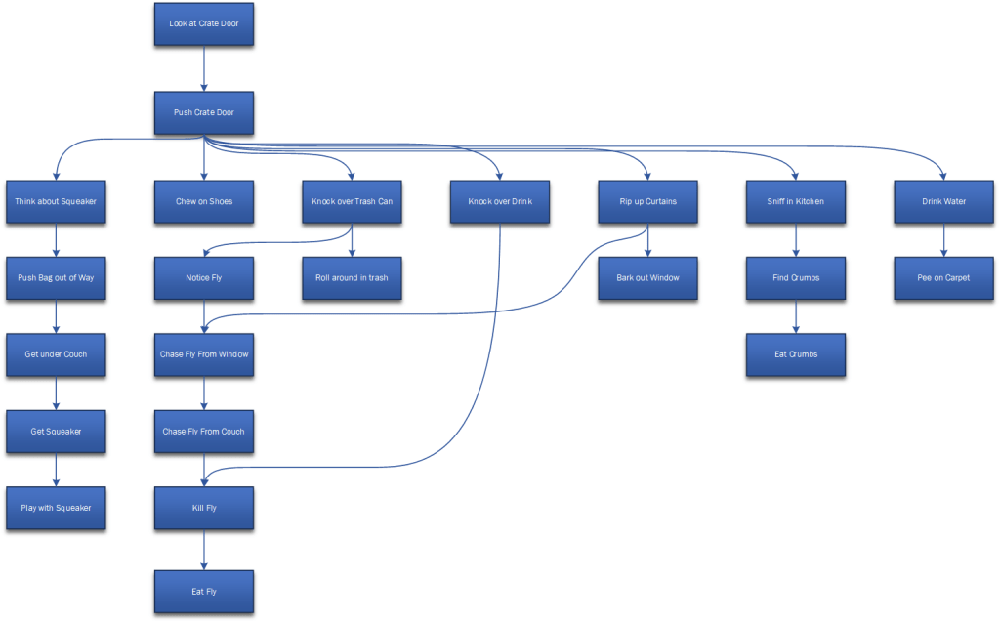
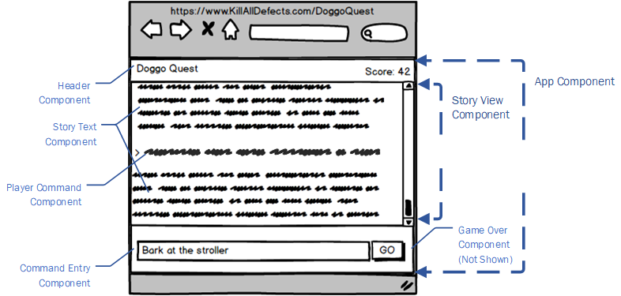

# Doggo Quest

Doggo Quest is small an Angular Interactive Fiction game created by [Matt Eland](https://twitter.com/integerman) as a teaching exercise to discuss various topics:

- [Event Modeling](https://killalldefects.com/2020/02/01/game-design-with-event-modeling/)
- Angular
- Material UI
- TypeScript
- Jest
- NgRx
- Compromise-NLP

The game involves you as a small dog that gets loose in its house while its owners are away. The player gets a fixed number of turns to cause as much mayhem as they desire before the owners return. Chaos ensues.

## Availability

Doggo Quest is not yet hosted online, but will be at a later date.

## Game Design

### Map

The game's map is defined as follows:

Image created in [Trizbort](https://github.com/genstein/trizbort)

### Event Modeling

I undertook an [exercise to use event modeling for game design](https://killalldefects.com/2020/02/01/game-design-with-event-modeling/) and the resulting graphic is included below:

### Puzzle Dependency Diagram

Additionally, I represented significant story beats in a [puzzle dependency diagram](http://thewebsiteisdown.com/twidblog/puzzle-dependency-graph-primer/) which is included below (Warning: Contains spoilers):

## Visual Structure

The application is a small one and only composed of a few components. Let's take a look at the mockup and how it maps to individual Angular Components:

The game's components are:

- App.Component - Main container for the application
- Header.Component - Contains the game title and high level game information, including the score
- Footer.Component - Holds the command entry component and the game over component
- StoryView.Component - Contains the game's narrative. New entries will be added to the bottom
- CommandEntry.Component - Allows the player to enter in game commands and submit them
- GameOver.Component - Shown when the game has ended and allows the user to restart the game
- PlayerCommand.Component - Represents something the player typed into the engine at one point and is now part of the story
- StoryText.Component - An individual paragraph within the game's narrative. Housed inside the StoryView.Component
